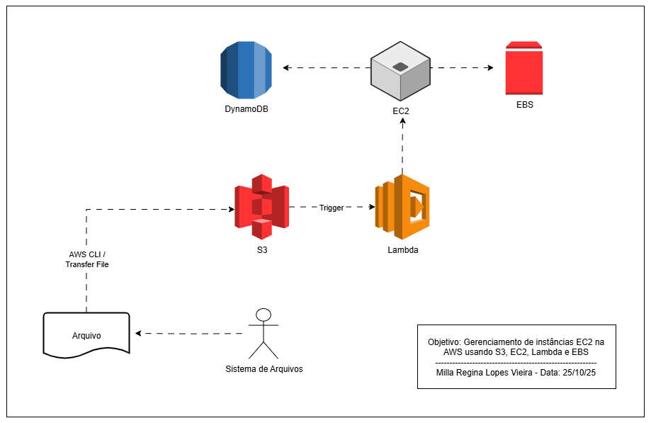

# Gerenciamento de Instâncias EC2 na AWS

Sou participante do programa **Santander Code Girls – 2025**, em parceria com a DIO (Digital Innovation One). Este repositório foi desenvolvido para documentar o desafio prático sobre gerenciamento de instâncias EC2 utilizando serviços essenciais da AWS.

## Objetivo do Projeto
Consolidar os conhecimentos adquiridos em um ambiente prático, integrando os serviços EC2, S3, EBS e Lambda para automatizar o gerenciamento de instâncias na nuvem.

## Arquitetura da Solução

### Fluxo do Gerenciamento:

1️⃣ O usuário envia um arquivo contendo instruções para o bucket S3  
2️⃣ O evento de upload no S3 aciona uma função Lambda  
3️⃣ A Lambda lê o arquivo e executa ações na instância EC2  
4️⃣ O volume EBS fornece armazenamento persistente à EC2  
5️⃣ Logs e dados do gerenciamento podem ser armazenados no DynamoDB

## Serviços Envolvidos

| Serviço | Função |
|--------|--------|
| **Amazon EC2** | Execução das aplicações e processamento principal |
| **Amazon EBS** | Volume de armazenamento vinculado à instância EC2 |
| **Amazon S3** | Armazenamento de arquivos e acionador do workflow |
| **AWS Lambda** | Responsável por automatizar as ações nas instâncias |
| **Amazon DynamoDB** | Registro de histórico e logs do gerenciamento |

## Conceitos Aplicados

- Criação e gerenciamento de instâncias EC2  
- Uso de volumes EBS como armazenamento persistente 
- Boas práticas de documentação técnica com GitHub  

## Autor
**Milla Regina Lopes Vieira**  🔗 [LinkedIn](https://www.linkedin.com/in/milla-regina-468020206/)